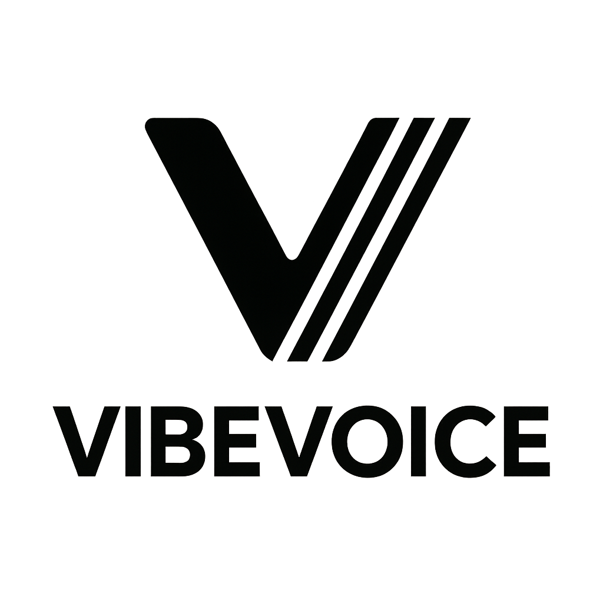

<div align="center">

## 🎙️ VibeVoice: Open-Source Frontier Voice AI
[](https://microsoft.github.io/VibeVoice)
[](https://huggingface.co/collections/microsoft/vibevoice-68a2ef24a875c44be47b034f)
[](https://arxiv.org/pdf/2508.19205)


</div>


<div align="center">
<picture>
  <source media="(prefers-color-scheme: dark)" srcset="Figures/VibeVoice_logo_white.png">
  
</picture>
</div>

<div align="left">

<h3>📰 News</h3>


<strong>2025-12-16: 📣 We added more experimental speakers for exploration, including multilingual voices and 11 distinct English style voices. [Try it](docs/vibevoice-realtime-0.5b.md#optional-more-experimental-voices). More speaker types will be added over time.</strong>

2025-12-09: 📣 We added experimental speakers in nine languages (DE, FR, IT, JP, KR, NL, PL, PT, ES) for exploration—welcome to try them out and share your feedback.

2025-12-03: 📣 We open-sourced <a href="docs/vibevoice-realtime-0.5b.md"><strong>VibeVoice‑Realtime‑0.5B</strong></a>, a real‑time text‑to‑speech model that supports streaming text input and robust long-form speech generation. Try it on [Colab](https://colab.research.google.com/github/microsoft/VibeVoice/blob/main/demo/vibevoice_realtime_colab.ipynb).

To mitigate deepfake risks and ensure low latency for the first speech chunk, voice prompts are provided in an embedded format. For users requiring voice customization, please reach out to our team. We will also be expanding the range of available speakers.
<br>

https://github.com/user-attachments/assets/0901d274-f6ae-46ef-a0fd-3c4fba4f76dc

> (Launch your own realtime demo via the websocket example in [Usage](docs/vibevoice-realtime-0.5b.md#usage-1-launch-real-time-websocket-demo)).

</div>

2025-09-05: VibeVoice is an open-source research framework intended to advance collaboration in the speech synthesis community. After release, we discovered instances where the tool was used in ways inconsistent with the stated intent. Since responsible use of AI is one of Microsoft’s guiding principles, we have disabled this repo until we are confident that out-of-scope use is no longer possible.


### Overview

VibeVoice is a novel framework designed for generating **expressive**, **long-form**, **multi-speaker** conversational audio, such as podcasts, from text. It addresses significant challenges in traditional Text-to-Speech (TTS) systems, particularly in scalability, speaker consistency, and natural turn-taking.

VibeVoice currently includes two model variants:

- **Long-form multi-speaker model**: Synthesizes conversational/single-speaker speech up to **90 minutes** with up to **4 distinct speakers**, surpassing the typical 1–2 speaker limits of many prior models.
- **[Realtime streaming TTS model](docs/vibevoice-realtime-0.5b.md)**: Produces initial audible speech in ~**300 ms** and supports **streaming text input** for single-speaker **real-time** speech generation; designed for low-latency generation.

A core innovation of VibeVoice is its use of continuous speech tokenizers (Acoustic and Semantic) operating at an ultra-low frame rate of 7.5 Hz. These tokenizers efficiently preserve audio fidelity while significantly boosting computational efficiency for processing long sequences. VibeVoice employs a [next-token diffusion](https://arxiv.org/abs/2412.08635) framework, leveraging a Large Language Model (LLM) to understand textual context and dialogue flow, and a diffusion head to generate high-fidelity acoustic details.


<p align="left">
  
  
</p>


### 🎵 Demo Examples


**Video Demo**

We produced this video with [Wan2.2](https://github.com/Wan-Video/Wan2.2). We sincerely appreciate the Wan-Video team for their great work.

**English**
<div align="center">

https://github.com/user-attachments/assets/0967027c-141e-4909-bec8-091558b1b784

</div>


**Chinese**
<div align="center">

https://github.com/user-attachments/assets/322280b7-3093-4c67-86e3-10be4746c88f

</div>

**Cross-Lingual**
<div align="center">

https://github.com/user-attachments/assets/838d8ad9-a201-4dde-bb45-8cd3f59ce722

</div>

**Spontaneous Singing**
<div align="center">

https://github.com/user-attachments/assets/6f27a8a5-0c60-4f57-87f3-7dea2e11c730

</div>


**Long Conversation with 4 people**
<div align="center">

https://github.com/user-attachments/assets/a357c4b6-9768-495c-a576-1618f6275727

</div>

For more examples, see the [Project Page](https://microsoft.github.io/VibeVoice).


## Risks and limitations

While efforts have been made to optimize it through various techniques, it may still produce outputs that are unexpected, biased, or inaccurate. VibeVoice inherits any biases, errors, or omissions produced by its base model (specifically, Qwen2.5 1.5b in this release).
Potential for Deepfakes and Disinformation: High-quality synthetic speech can be misused to create convincing fake audio content for impersonation, fraud, or spreading disinformation. Users must ensure transcripts are reliable, check content accuracy, and avoid using generated content in misleading ways. Users are expected to use the generated content and to deploy the models in a lawful manner, in full compliance with all applicable laws and regulations in the relevant jurisdictions. It is best practice to disclose the use of AI when sharing AI-generated content.

English and Chinese only: Transcripts in languages other than English or Chinese may result in unexpected audio outputs.

Non-Speech Audio: The model focuses solely on speech synthesis and does not handle background noise, music, or other sound effects.

Overlapping Speech: The current model does not explicitly model or generate overlapping speech segments in conversations.

We do not recommend using VibeVoice in commercial or real-world applications without further testing and development. This model is intended for research and development purposes only. Please use responsibly.

## Star History


## 🤝 Contributions & Fork Enhancements

This fork has been enhanced with **68 commits** by [@devasphn](https://github.com/devasphn) with the following major additions and improvements:

### Core Features Added

#### 1. **Automatic Speech Recognition (ASR) Integration** 🎤
- Implemented **Whisper (faster-distil-whisper-small)** for real-time speech-to-text capabilities
- Integrated Whisper LLM models for accurate transcription of speech input
- Added ASR module configuration supporting multiple model variants (tiny, small, medium, large-v2, large-v3, large-v3-turbo)
- Enables end-to-end voice interaction pipeline with accurate speech recognition

#### 2. **Speech-to-Speech (S2S) Pipeline** 🎵
- Developed complete speech-to-speech conversion pipeline in `/speech_to_speech` directory
- Created modular frontend application for real-time voice processing
- Implemented S2S pipeline orchestration with Docker support
- Added architecture documentation for the S2S module
- Includes ASR module integration for converting spoken audio to text

#### 3. **LLM Integration (Llama-3.2)** 🧠
- Implemented complete **VibeVoice + Llama-3.2** end-to-end pipeline
- Pipeline flow: Text Input → LLM Response Generation → TTS Audio Output
- Integrated Llama-3.2-3B and Llama-3.2-1B models for intelligent dialogue
- Added async processing for non-blocking LLM inference
- Supports custom prompt engineering and response processing
- Includes graceful error handling and timeout management

#### 4. **WebSocket Real-time Communication** ⚡
- Refactored WebSocket connection handling for robust real-time audio streaming
- Implemented latency optimization for low-latency voice agent responses (~300ms)
- Added comprehensive error handling and connection state management
- Supports bidirectional streaming of audio data with proper buffering
- Fixed Colab download issues for streaming stability

#### 5. **Web Interface Components** 🖥️
- **`vibevoice_llm_interface.html`**: Interactive web UI for Llama-3.2 integration
- **`vibevoice_llm_demo.html`**: Demo interface showcasing LLM + TTS capabilities
- Implemented real-time chat interface with voice input/output
- Clean, responsive UI with status indicators and latency monitoring

#### 6. **Data Preparation & Fine-tuning Framework** 📊
- **`/fine_tuning` directory**: Complete fine-tuning infrastructure
  - `prepare_data.py`: Intelligent data preprocessing and augmentation
  - `expand_automobile_data.py`: Dataset expansion utilities
  - `train_automobile.py` & `train_automobile_peft.py`: LoRA-based fine-tuning
  - `train_medical.py` & `train_medical_peft.py`: Domain-specific training
  - Configuration and dependency management scripts

#### 7. **Training Data Generation** 🏋️
- **`/training` directory**: Comprehensive training data creation pipeline
  - `create_training_data.py`: Generates training datasets for model fine-tuning
  - Supports batch creation and data validation
  - Integrated with the fine-tuning pipeline

#### 8. **Application Pipeline & Architecture** 🔄
- **`app_pipeline.py`**: Main application orchestration layer
  - Manages ASR → LLM → TTS pipeline coordination
  - Handles configuration management and environment setup
  - Integrates all modules for complete voice agent functionality
- **`pyproject.toml`**: Dependency management and project configuration
- Full Docker support with proper containerization

### Key Improvements

✅ **End-to-End Voice Agent**: Complete pipeline from voice input to voice output

✅ **Real-time Processing**: Optimized for low-latency responses in conversational scenarios

✅ **Modular Architecture**: Each component (ASR, LLM, TTS) can be used independently

✅ **Production-Ready**: Includes error handling, logging, and deployment configurations

✅ **Multiple Model Support**: Flexible model configurations for different use cases

✅ **Web Integration**: Interactive web interfaces for testing and deployment

✅ **Fine-tuning Support**: Complete framework for domain-specific model adaptation

### Development Workflow

- **85 Total Commits**: Iterative development with careful feature integration
- **Code Generation**: Implemented using Windsurf AI with custom logic and architecture design
- **Testing**: Extensive testing on streaming audio, WebSocket connections, and LLM integration
- **Documentation**: Architecture documentation and inline code comments

### Directory Structure Overview

```
├── speech_to_speech/      # S2S pipeline with ASR module
├── fine_tuning/           # Fine-tuning framework and scripts
├── training/              # Training data generation
├── vibevoice/             # Core VibeVoice model implementation
├── app_pipeline.py        # Main orchestration layer
├── vibevoice_llm_interface.html  # Web UI for LLM integration
└── vibevoice_llm_demo.html       # Demo interface
```

### Future Enhancements

- Support for more ASR models and languages
- Multi-language LLM integration
- Advanced voice cloning capabilities
- Real-time voice style transfer
- Integration with additional speech processing models

---

**Note**: This fork represents a comprehensive enhancement of VibeVoice for production voice agent applications with a focus on real-time performance and modularity. All enhancements maintain compatibility with the original VibeVoice architecture while adding powerful new capabilities for voice-based AI interactions.
