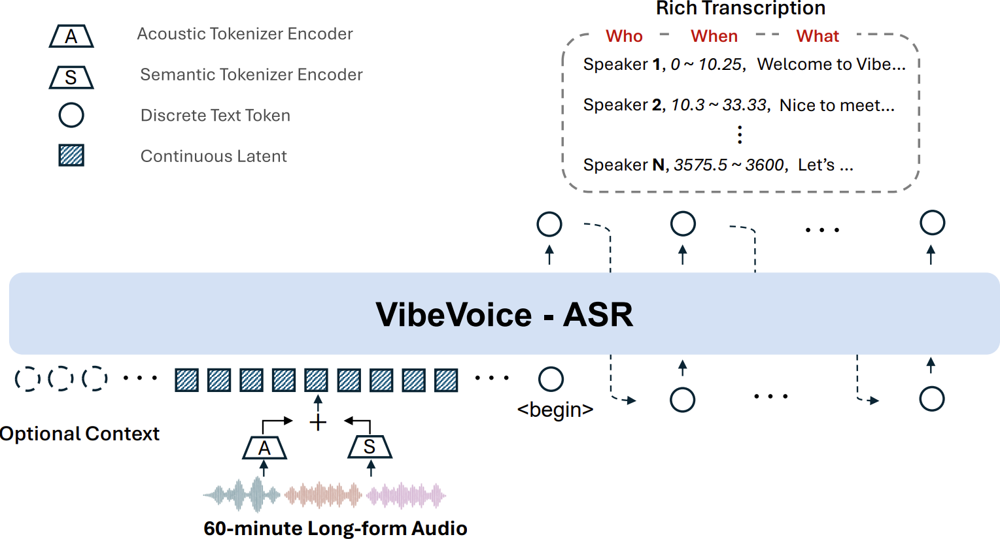
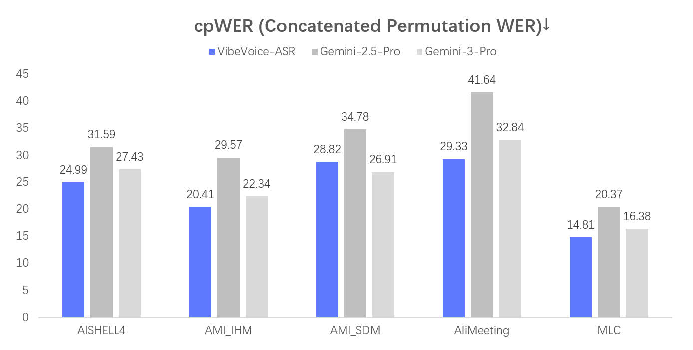
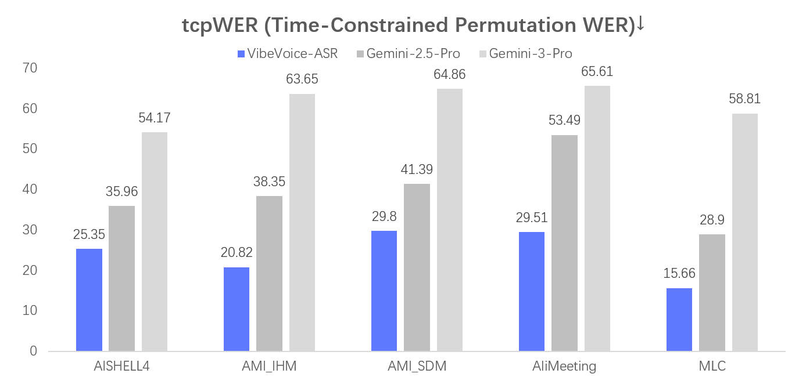

# VibeVoice-ASR

[](https://huggingface.co/microsoft/VibeVoice-ASR)
[](https://aka.ms/vibevoice-asr)

**VibeVoice-ASR** is a unified speech-to-text model designed to handle **60-minute long-form audio** in a single pass, generating structured transcriptions containing **Who (Speaker), When (Timestamps), and What (Content)**, with support for **Customized Hotwords** and over **50 languages**.

**Model:** [VibeVoice-ASR-7B](https://huggingface.co/microsoft/VibeVoice-ASR)  
**Demo:** [VibeVoice-ASR-Demo](https://aka.ms/vibevoice-asr)  
**Report:** [VibeVoice-ASR-Report](https://arxiv.org/pdf/2601.18184)  
**Finetuning:** [finetune-guide](../finetuning-asr/README.md)  
**vLLM:** [vLLM-asr](./vibevoice-vllm-asr.md)  
**Transformers:** [VibeVoice-ASR-HF](https://huggingface.co/microsoft/VibeVoice-ASR-HF)

## 🔥 Key Features

* **🕒 60-minute Single-Pass Processing**:
  Unlike conventional ASR models that slice audio into short chunks (often losing global context), VibeVoice ASR accepts up to **60 minutes** of continuous audio input within 64K token length. This ensures consistent speaker tracking and semantic coherence across the entire hour.
  > ⚠️ **Note:** The 60-minute single-pass capability requires sufficient GPU VRAM. See [Hardware Requirements](#%EF%B8%8F-hardware-requirements--vram-guide) below for GPU-specific limits and workarounds.
* **👤 Customized Hotwords**:
  Users can provide customized hotwords (e.g., specific names, technical terms, or background info) to guide the recognition process, significantly improving accuracy on domain-specific content.
* **📝 Rich Transcription (Who, When, What)**:
  The model jointly performs ASR, diarization, and timestamping, producing a structured output that indicates *who* said *what* and *when*.
* **🌍 Multilingual & Code-Switching Support**:
  It supports over 50 languages, requires no explicit language setting, and natively handles code-switching within and across utterances. See the [Language distribution](#language-distribution).

## 🏗️ Model Architecture



## 🖥️ Hardware Requirements & VRAM Guide

> This section documents empirically observed VRAM-vs-audio-duration limits so you can choose the right attention backend and hardware tier before running inference.

### Why VRAM scales with audio duration

VibeVoice-ASR encodes audio as continuous tokens at **7.5 Hz**. A 60-minute file produces ~27,000 audio tokens. The attention mechanism (`sdpa` by default) must attend over all tokens simultaneously, so **peak VRAM grows roughly quadratically with audio length** for standard attention, and linearly for `flash_attention_2`.

### Empirically observed limits

| GPU (VRAM) | Attention backend | Max audio duration (single pass) | Notes |
|---|---|---|---|
| RTX 4090 (24 GB) | `sdpa` (default) | ~30 min | Peak ~22 GB at 30 min; OOM beyond that |
| RTX 4090 (24 GB) | `flash_attention_2` | ~60 min | Recommended for 24 GB cards |
| A100 / H100 (40–80 GB) | `sdpa` or `flash_attention_2` | 60 min | The recommended container (`nvcr.io/nvidia/pytorch:25.12-py3`) targets this tier |

> **Community data point (issue [#367](https://github.com/microsoft/VibeVoice/issues/367)):**  
> RTX 4090, 24 GB VRAM, `sdpa`: 30 min → ✅ success (~22 GB peak, ~5.2× realtime); 50 min → ❌ OOM (tried to allocate 6.50 GiB, only 4.34 GiB free).

### Option 1 — Use `flash_attention_2` (recommended for ≤24 GB GPUs)

Flash Attention 2 uses a memory-efficient tiled algorithm that reduces peak VRAM from O(n²) to O(n), making 60-minute audio feasible on 24 GB cards.

**Install flash-attn** (requires CUDA ≥ 11.6, PyTorch ≥ 2.0):

```bash
pip install flash-attn --no-build-isolation
```

**Run inference with flash attention:**

```bash
python demo/vibevoice_asr_inference_from_file.py \
    --model_path microsoft/VibeVoice-ASR \
    --audio_files your_audio.m4a \
    --device cuda \
    --attn_implementation flash_attention_2
```

### Option 2 — Chunked inference for smaller GPUs (no flash-attn required)

If you cannot install flash-attn or are on a GPU with less than 24 GB VRAM, you can split audio into overlapping chunks and transcribe each independently.

> **⚠️ Caveat:** Each chunk receives independent speaker diarization, so speaker IDs (e.g. `SPEAKER_00`) are **not consistent** across chunks. Post-processing is needed to re-align speaker labels if you need a globally consistent diarization.

A ready-to-run chunked inference script is available at [`demo/vibevoice_asr_chunked_inference.py`](../demo/vibevoice_asr_chunked_inference.py):

```bash
python demo/vibevoice_asr_chunked_inference.py \
    --model_path microsoft/VibeVoice-ASR \
    --audio_file your_long_audio.m4a \
    --chunk_minutes 25 \
    --device cuda
```

This splits the audio into 25-minute chunks (safe for RTX 4090 `sdpa`) and concatenates the transcription outputs.

### Quick decision guide

```
Do you have 40+ GB VRAM (A100/H100)?
  └─ Yes → Use default sdpa. 60 min single-pass works out of the box.
  └─ No (e.g. RTX 4090, 24 GB):
       Can you install flash-attn?
         └─ Yes → Use --attn_implementation flash_attention_2 (60 min works)
         └─ No  → Use chunked inference script (25-min chunks recommended)
```

---

## Demo

<!-- video embed preserved from original -->

## Evaluation

  
  


## Installation

We recommend using NVIDIA Deep Learning Container to manage the CUDA environment.

1. Launch docker

```bash
# NVIDIA PyTorch Container 24.07 ~ 25.12 verified.
# Previous versions are also compatible.
sudo docker run --privileged --net=host --ipc=host \
    --ulimit memlock=-1:-1 --ulimit stack=-1:-1 \
    --gpus all --rm -it \
    nvcr.io/nvidia/pytorch:25.12-py3

# If flash attention is not included in your docker environment,
# install it manually (strongly recommended for GPUs with ≤24 GB VRAM):
# pip install flash-attn --no-build-isolation
```

2. Install from GitHub

```bash
git clone https://github.com/microsoft/VibeVoice.git
cd VibeVoice
pip install -e .
```

## Usages

### Usage 1: Launch Gradio demo

```bash
apt update && apt install ffmpeg -y  # for demo

python demo/vibevoice_asr_gradio_demo.py \
    --model_path microsoft/VibeVoice-ASR \
    --share
```

### Usage 2: Inference from files directly

```bash
# Standard (requires ≥40 GB VRAM for 60-min audio, or use flash_attention_2 on 24 GB):
python demo/vibevoice_asr_inference_from_file.py \
    --model_path microsoft/VibeVoice-ASR \
    --audio_files [add an audio path here]

# For 24 GB GPUs — add flash_attention_2:
python demo/vibevoice_asr_inference_from_file.py \
    --model_path microsoft/VibeVoice-ASR \
    --audio_files [add an audio path here] \
    --device cuda \
    --attn_implementation flash_attention_2

# For smaller GPUs without flash-attn — use chunked inference:
python demo/vibevoice_asr_chunked_inference.py \
    --model_path microsoft/VibeVoice-ASR \
    --audio_file [add an audio path here] \
    --chunk_minutes 25
```

## Finetuning

LoRA (Low-Rank Adaptation) fine-tuning is supported. See [Finetuning](../finetuning-asr/README.md) for detailed guide.

## Results

### Multilingual

| Dataset | Language | DER | cpWER | tcpWER | WER |
|---|---|---|---|---|---|
| MLC-Challenge | English | 4.28 | 11.48 | 13.02 | 7.99 |
| MLC-Challenge | French | 3.80 | 18.80 | 19.64 | 15.21 |
| MLC-Challenge | German | 1.04 | 17.10 | 17.26 | 16.30 |
| MLC-Challenge | Italian | 2.08 | 15.76 | 15.91 | 13.91 |
| MLC-Challenge | Japanese | 0.82 | 15.33 | 15.41 | 14.69 |
| MLC-Challenge | Korean | 4.52 | 15.35 | 16.07 | 9.65 |
| MLC-Challenge | Portuguese | 7.98 | 29.91 | 31.65 | 21.54 |
| MLC-Challenge | Russian | 0.90 | 12.94 | 12.98 | 12.40 |
| MLC-Challenge | Spanish | 2.67 | 10.51 | 11.71 | 8.04 |
| MLC-Challenge | Thai | 4.09 | 14.91 | 15.57 | 13.61 |
| MLC-Challenge | Vietnamese | 0.16 | 14.57 | 14.57 | 14.43 |

---

| Dataset | Language | DER | cpWER | tcpWER | WER |
|---|---|---|---|---|---|
| AISHELL-4 | Chinese | 6.77 | 24.99 | 25.35 | 21.40 |
| AMI-IHM | English | 11.92 | 20.41 | 20.82 | 18.81 |
| AMI-SDM | English | 13.43 | 28.82 | 29.80 | 24.65 |
| AliMeeting | Chinese | 10.92 | 29.33 | 29.51 | 27.40 |
| MLC-Challenge | Average | 3.42 | 14.81 | 15.66 | 12.07 |

## Language Distribution


## 📄 License

This project is licensed under the [MIT License](../LICENSE).
