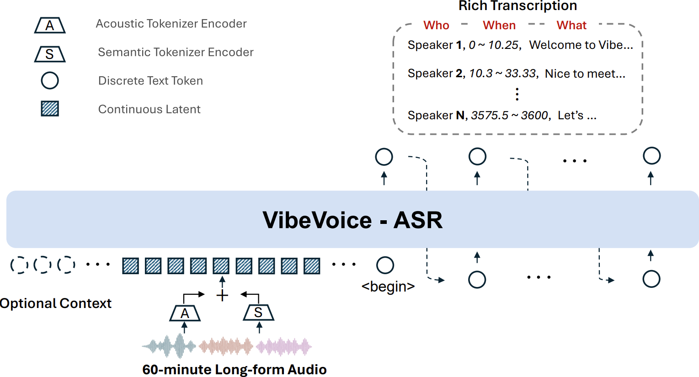
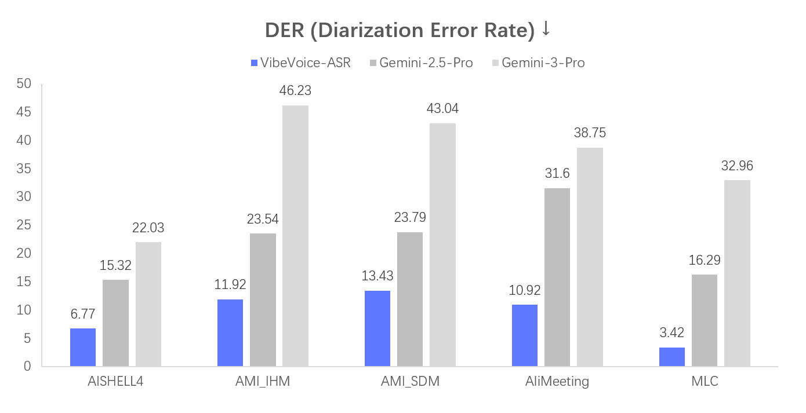
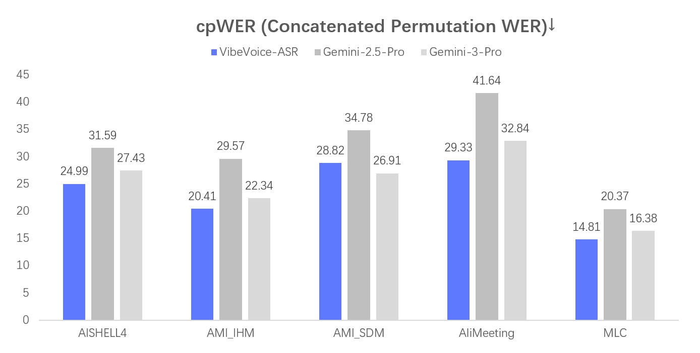
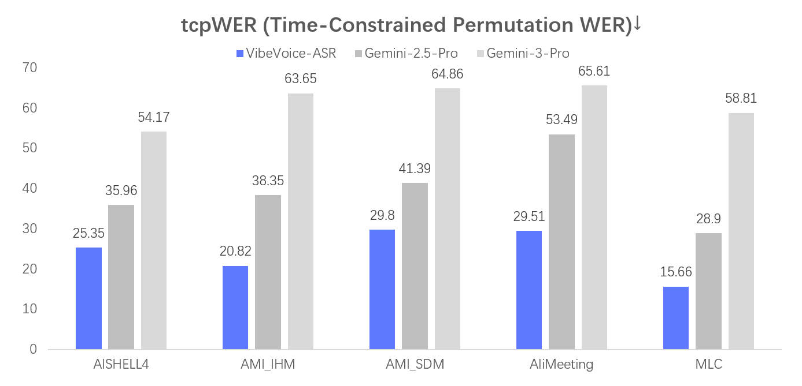

# VibeVoice-ASR

[](https://huggingface.co/microsoft/VibeVoice-ASR)
[](https://aka.ms/vibevoice-asr)

**VibeVoice-ASR** is a unified speech-to-text model designed to handle **60-minute long-form audio** in a single pass, generating structured transcriptions containing **Who (Speaker), When (Timestamps), and What (Content)**, with support for **Customized Hotwords** and over **50 languages**.

**Model:** [VibeVoice-ASR-7B](https://huggingface.co/microsoft/VibeVoice-ASR)<br>
**Demo:** [VibeVoice-ASR-Demo](https://aka.ms/vibevoice-asr)<br>
**Report:** [VibeVoice-ASR-Report](https://arxiv.org/pdf/2601.18184)<br>
**Finetuning:** [finetune-guide](../finetuning-asr/README.md)<br>
**vLLM:** [vLLM-asr](./vibevoice-vllm-asr.md)<br>
**Transformers:** [VibeVoice-ASR-HF](https://huggingface.co/microsoft/VibeVoice-ASR-HF)<br>


## 🔥 Key Features

- **🕒 60-minute Single-Pass Processing**:
  Unlike conventional ASR models that slice audio into short chunks (often losing global context), VibeVoice ASR accepts up to **60 minutes** of continuous audio input within 64K token length. This ensures consistent speaker tracking and semantic coherence across the entire hour.

- **👤 Customized Hotwords**:
  Users can provide customized hotwords (e.g., specific names, technical terms, or background info) to guide the recognition process, significantly improving accuracy on domain-specific content.

- **📝 Rich Transcription (Who, When, What)**:
  The model jointly performs ASR, diarization, and timestamping, producing a structured output that indicates *who* said *what* and *when*.
  
- **🌍 Multilingual & Code-Switching Support**:
  It supports over 50 languages, requires no explicit language setting, and natively handles code-switching within and across utterances. See the [Language distribution](#language-distribution).


## 🏗️ Model Architecture

<p align="center">
  
</p>

# Demo

<div align="center" id="vibevoice-asr">

https://github.com/user-attachments/assets/acde5602-dc17-4314-9e3b-c630bc84aefa

</div>

## Evaluation
<p align="center">
  <br>
  <br>
  
</p>


## Installation
We recommend using NVIDIA Deep Learning Container to manage the CUDA environment. 

1. Launch docker
```bash
# NVIDIA PyTorch Container 24.07 ~ 25.12 verified. 
# Previous versions are also compatible.
sudo docker run --privileged --net=host --ipc=host --ulimit memlock=-1:-1 --ulimit stack=-1:-1 --gpus all --rm -it  nvcr.io/nvidia/pytorch:25.12-py3

## If flash attention is not included in your docker environment, you need to install it manually
## Refer to https://github.com/Dao-AILab/flash-attention for installation instructions
# pip install flash-attn --no-build-isolation
```

2. Install from github 
```bash
git clone https://github.com/microsoft/VibeVoice.git
cd VibeVoice

pip install -e .
```

## Usages

### Usage 1: Launch Gradio demo
```bash
apt update && apt install ffmpeg -y # for demo

python demo/vibevoice_asr_gradio_demo.py --model_path microsoft/VibeVoice-ASR --share
```

### Usage 2: Inference from files directly
```bash
python demo/vibevoice_asr_inference_from_file.py --model_path microsoft/VibeVoice-ASR --audio_files [add an audio path here] 
```

### Practical notes for long audio

For recordings that exceed the configured single-pass limit, or when GPU memory
is constrained, a practical fallback is to split the audio into bounded chunks
and stitch the structured outputs after inference.

A robust chunked workflow should:

1. keep each chunk within the duration and token length validated for the target
   deployment, for example 30-minute chunks;
2. run ASR independently for each chunk;
3. add the chunk start time back to every predicted segment timestamp;
4. concatenate the timestamp-adjusted segments;
5. validate timestamp coverage, timestamp monotonicity, and repeated-text loops,
   not only WER.

When chunking, speaker labels may be local to each chunk. Applications that need
globally consistent speaker identities should add a separate speaker-linking or
diarization step across chunks.

For single-pass runs near the context boundary, YaRN RoPE scaling can improve
long-audio robustness when the model's existing context configuration is used as
the base. In one 11-item long-form stress test, setting
`rope_type=yarn`, `factor=1.5`, and
`original_max_position_embeddings=131072` preserved 30-minute quality while
removing the observed 90-minute collapse cases:

| Setting | e22 90m WER | e22 coverage | TED 90m WER | TED coverage | 11-item mean WER | Collapses |
|---|---:|---:|---:|---:|---:|---:|
| No RoPE override | 0.5824 | 77.6% | 0.8250 | 21.8% | 0.2328 | 2 |
| YaRN, factor=1.5, original_max=131072 | 0.4859 | 82.0% | 0.3422 | 91.0% | 0.2542 | 0 |

This is a robustness trade-off rather than a memory optimization: YaRN changes
position scaling, but it does not reduce KV-cache size or activation memory.
Validate the factor on the target audio distribution before using it as the
default path.

For Hugging Face generation, memory use can also depend on prefill-time
intermediate tensors. If your inference stack supports it, setting
`logits_to_keep=1` can avoid computing full vocabulary logits for every prefill
position. Chunked prefill can further reduce activation peaks, at the cost of
additional runtime.


## Finetuning
LoRA (Low-Rank Adaptation) fine-tuning is supported. See [Finetuning](../finetuning-asr/README.md) for detailed guide.


## Results

### Multilingual
| Dataset        | Language  | DER  | cpWER | tcpWER | WER  |
|----------------|-----------|------|-------|--------|------|
| MLC-Challenge  | English   | 4.28 | 11.48 | 13.02  | 7.99  |
| MLC-Challenge  | French    | 3.80 | 18.80 | 19.64  | 15.21 |
| MLC-Challenge  | German    | 1.04 | 17.10 | 17.26  | 16.30 |
| MLC-Challenge  | Italian   | 2.08 | 15.76 | 15.91  | 13.91 |
| MLC-Challenge  | Japanese  | 0.82 | 15.33 | 15.41  | 14.69 |
| MLC-Challenge  | Korean    | 4.52 | 15.35 | 16.07  | 9.65  |
| MLC-Challenge  | Portuguese| 7.98 | 29.91 | 31.65  | 21.54 |
| MLC-Challenge  | Russian   | 0.90 | 12.94 | 12.98  | 12.40 |
| MLC-Challenge  | Spanish   | 2.67 | 10.51 | 11.71  | 8.04  |
| MLC-Challenge  | Thai      | 4.09 | 14.91 | 15.57  | 13.61 |
| MLC-Challenge  | Vietnamese| 0.16 | 14.57 | 14.57  | 14.43 |

---

| Dataset        | Language  | DER  | cpWER | tcpWER | WER  |
|----------------|-----------|------|-------|--------|------|
| AISHELL-4      | Chinese   | 6.77 | 24.99 | 25.35  | 21.40 |
| AMI-IHM        | English   | 11.92| 20.41 | 20.82  | 18.81 |
| AMI-SDM        | English   | 13.43| 28.82 | 29.80  | 24.65 |
| AliMeeting     | Chinese   | 10.92| 29.33 | 29.51  | 27.40 |
| MLC-Challenge  | Average   | 3.42 | 14.81 | 15.66  | 12.07|


## Language Distribution
<p align="center">
  
</p>

## 📄 License

This project is licensed under the [MIT License](../LICENSE).


